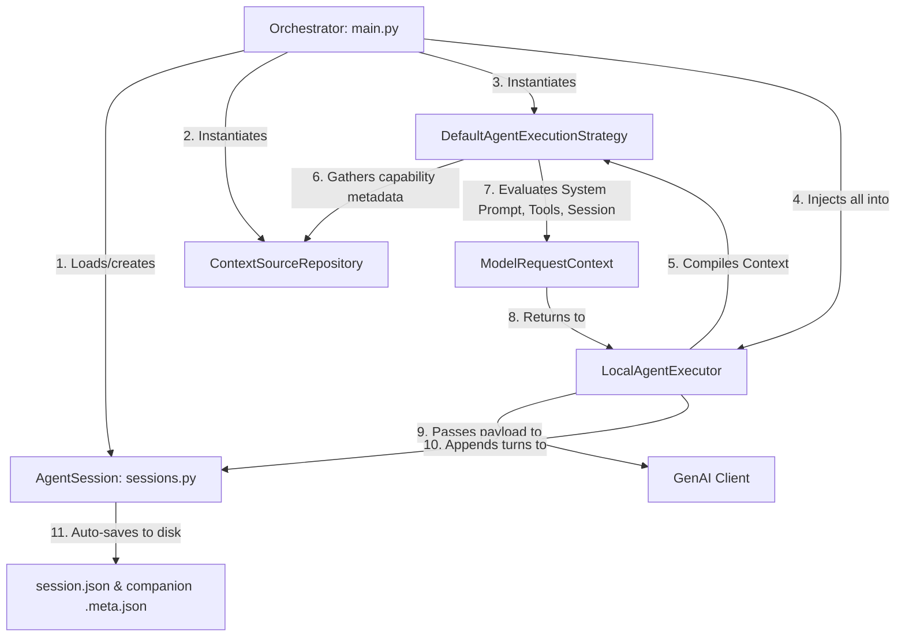

# Strategy-Based Context & Execution Pipeline Implementation Plan

This plan details how we will evolve the Python replica's prompt builder into a **fully typed, strategy-driven context and execution pipeline** with robust boundaries, zero redundant disk I/O, and clean async event-loop hygiene.

Following our architectural audit, we are resolving several critical risks and anti-patterns (such as silent exception swallowing, shared tool state corruption, and amnesia-inducing history compression) with highly performant, production-grade patterns.

---

## 1. System Architecture Diagram

### 1.1 Complete Separation of Concerns
1. **The Client / Bootstrapper ([main.py](file:///Users/izo/code/tmp/playground/gemini_replica/main.py))**: Responsible for platform metadata resolution, CLI arguments parsing, and initializing inputs, repositories, and active sessions before injecting them into the executor.
2. **The Context Source Repository ([ContextSourceRepository](file:///Users/izo/code/tmp/playground/gemini_replica/context.py))**: The unified capability and discovery layer. Manages active workspace directories, subagents discovery lists, registered skills, local tools, and configured MCP servers.
3. **The Context Strategy ([PromptStrategy](file:///Users/izo/code/tmp/playground/gemini_replica/context.py))**: Acts as the compiler. Takes the stateful `AgentSession` reference, processes history (evaluating compression via its composed `ChatCompressionService`), and outputs a typed **`ModelRequestContext`** containing compiled system instructions, active tool declarations, and pre-processed context history contents.
4. **The Session Layer ([AgentSession] and [SessionManager](file:///Users/izo/code/tmp/playground/gemini_replica/sessions.py))**: The state and persistence layer. Represents an active conversation, manages active message arrays, appends user/model turns, and automatically synchronizes full histories and metadata sidecars (`.meta.json`) to disk on every state mutation.
5. **The Executor ([LocalAgentExecutor](file:///Users/izo/code/tmp/playground/gemini_replica/executor.py))**: A lightweight, state-free engine that runs the turn loop, handles streaming, and coordinates tool execution through the guard chain. It holds no raw history and delegates all state operations to the session layer.

---

## 2. Key Findings & Critical Anti-Patterns Resolved

### 2.1 Silent Exception Swallowing
* **Issue**: The current telemetry subscription model in [bus.py](file:///Users/izo/code/tmp/playground/gemini_replica/bus.py) uses `asyncio.gather(*tasks, return_exceptions=True)` to execute listeners. Since the returned exceptions array is never inspected or logged, any listener or callback failure is completely hidden, making troubleshooting extremely difficult.
* **Resolution**: Explicitly inspect the return values of `asyncio.gather` and log any caught exceptions with standard traceback details to stderr, preserving event loop integrity while maintaining clear execution visibility.

### 2.2 Shared Tool State Corruption
* **Issue**: Child subagents map tools from the parent registry by reference. When the runner modifies `t.message_bus = self.bus` on a tool inside the executor turn loop, it overwrites the reference on the *shared global instance*. If multiple subagents run concurrently, they scramble each other's message bus, resulting in corrupted telemetry routing.
* **Resolution**: Refactor [registry.py](file:///Users/izo/code/tmp/playground/gemini_replica/registry.py)'s `get_tool()` method to return a shallow copy of the tool (`copy.copy(tool)`) so that modifications to individual instances (e.g. setting their `message_bus`) remain strictly isolated within their active executing thread or container.

### 2.3 Init-Level Task Spawning
* **Issue**: [timer.py](file:///Users/izo/code/tmp/playground/gemini_replica/timer.py)'s `DeadlineTimer` spawns a background asyncio task in its `__init__` constructor. This throws a `RuntimeError` if instantiated before an event loop is running, causing test runner crashes and bootstrapping complexity.
* **Resolution**: Defer task creation by introducing an explicit `start()` method on `DeadlineTimer` which is called safely inside the executor's async `run()` loop.

### 2.4 Stateful Desynchronization of Compressed History
* **Issue**: If the Context Strategy (or a standalone helper) asynchronously compresses history during compilation, it creates a state sync problem if the Executor holds raw history in memory. The Executor's raw array and the session on disk remain bloated, while only the in-context compilation is summarized.
* **Resolution**: Refactor history management completely out of the Executor into a stateful **`AgentSession`** service. `DefaultAgentExecutionStrategy` receives the stateful session reference, and its composed `ChatCompressionService` mutates the history *directly inside the session* (setting the compacted array). The session auto-saves the mutated state to disk immediately. This ensures that the active context, the in-memory state, and the on-disk storage are always 100% synchronized and free of desynchronization risks.

---

## 3. Performance Optimizations & Boundary Validation

### 3.1 Pydantic Validation Boundaries
We define explicit Pydantic models at the exact serialization bounds:
1. **`SubagentDefinition`** in [agents.py](file:///Users/izo/code/tmp/playground/gemini_replica/agents.py) to validate YAML configurations upon agent discovery.
2. **`SessionPayload`** & **`SessionMetadataPayload`** in [sessions.py](file:///Users/izo/code/tmp/playground/gemini_replica/sessions.py) to structurally validate active and cached sessions during reads, writes, and listings.

### 3.2 Companion `.meta.json` Sidecars
To eliminate the performance penalty of loading massive chat files during listings:
* **On Save**: Writing a session to `<session_id>.json` will also write a tiny companion `<session_id>.meta.json` containing only the session metadata and the `turn_count`.
* **On Listing**: `list_sessions()` will read *only* the companion `.meta.json` files, preventing expensive disk reads and parsing of massive full histories.

### 3.3 Stateless `.gitignore` Loading & Verification
To stop quadratic disk hits ($O(N^2)$) during directory walks, recursive grep searches, and globs, we avoid stateful global in-memory caches or repeated `os.stat` checks in [tools.py](file:///Users/izo/code/tmp/playground/gemini_replica/tools.py):
* **Single-Load Pattern**: We load and parse the `.gitignore` files *exactly once* at the high-level entry point of each tool execution (e.g., at the start of `GrepSearchTool.run` or `ListDirectoryTool.run`).
* **Stateless Flow**: The compiled match/ignore functions or patterns are passed down as pure parameters through recursive helper walks or helper calls.
* This achieves perfect $O(1)$ disk hits per tool run, introduces zero state-invalidation risks, and keeps the ignore checks 100% pure and stateless.

### 3.4 Discovered Workspace Skills Cache
Because user workspace custom capabilities are static, we cache the results of directory crawling in `SkillManager` inside [skills.py](file:///Users/izo/code/tmp/playground/gemini_replica/skills.py) on first load. Subsequent requests are returned instantly, avoiding recursive filesystem hits.

### 3.5 Pre-Compiled Tool Schemas
We pre-compile and store the JSON schema declaration in `BaseTool.__init__` in [tools.py](file:///Users/izo/code/tmp/playground/gemini_replica/tools.py) instead of re-traversing the Pydantic class trees during model context compilation on every single turn.

### 3.6 Immutability with Slotted Frozen Communication Structs
All internal communication dataclasses in [types.py](file:///Users/izo/code/tmp/playground/gemini_replica/types.py) are converted to frozen slotted dataclasses (`frozen=True`, `slots=True`):
* **Why it's better than JS CLI**: In JS/TS, the CLI relies on TypeScript's build-time `readonly` check which is completely stripped at runtime, leaving standard mutable objects. In Python, `frozen=True` provides strict runtime immutability, while `slots=True` eliminates the dynamic `__dict__` overhead, leading to faster attribute access and substantially lower memory consumption during heavy async turns.

### 3.7 Programmatic Generic Event Envelopes
To eliminate stringly-typed dictionary payloads on the message bus, we introduce:
* `EventType` and `ActivityType` enums.
* Slotted frozen dataclasses for payload structures.
* A generic container `EventEnvelope[T]` wrapping payload items with typed metadata.

---

## 4. Proposed Changes

### Component 1: Built-In Subagents Externalization
* **[NEW] Directory [gemini_replica/prompts/agents/](file:///Users/izo/code/tmp/playground/gemini_replica/prompts/agents/)**
* **[NEW] [codebase_investigator.agent.yaml](file:///Users/izo/code/tmp/playground/gemini_replica/prompts/agents/codebase_investigator.agent.yaml)**: YAML card with reverse-engineering instructions and schema.
* **[NEW] [cli_help.agent.yaml](file:///Users/izo/code/tmp/playground/gemini_replica/prompts/agents/cli_help.agent.yaml)**: Documentation helper.
* **[NEW] [generalist.agent.yaml](file:///Users/izo/code/tmp/playground/gemini_replica/prompts/agents/generalist.agent.yaml)**: All-tools generalist.
* **[MODIFY] [agents.py](file:///Users/izo/code/tmp/playground/gemini_replica/agents.py)**:
  * Parse `.agent.yaml` files via a Pydantic `SubagentDefinition` model.
  * Load defaults from the yaml directory on startup.
  * Completely erase hardcoded default Python dictionaries.

### Component 2: Boundary Types & Telemetry Overhaul
* **[MODIFY] [types.py](file:///Users/izo/code/tmp/playground/gemini_replica/types.py)**:
  * Add `frozen=True` to standard communication structs.
  * Define `EventType` and `ActivityType` enums.
  * Define telemetry payloads and generic `EventEnvelope[T]`.
* **[MODIFY] [bus.py](file:///Users/izo/code/tmp/playground/gemini_replica/bus.py)**:
  * Adapt publish, subscribe, and request methods to support typed `EventEnvelope`.
  * Inspect `asyncio.gather` results to explicitly log error tracebacks.

### Component 3: Performance, Caching & Stateful Sessions Refactoring
* **[MODIFY] [tools.py](file:///Users/izo/code/tmp/playground/gemini_replica/tools.py)**:
  * Compile and cache JSON declarations during `BaseTool.__init__`.
  * Add modification-time (`st_mtime`) caching to `should_ignore_path`.
  * Simplify the double-loop directory walker in `GrepSearchTool` to a clean list comprehension.
* **[MODIFY] [skills.py](file:///Users/izo/code/tmp/playground/gemini_replica/skills.py)**:
  * Cache discovered workspace skills in-memory after initial file crawl.
* **[MODIFY] [sessions.py](file:///Users/izo/code/tmp/playground/gemini_replica/sessions.py)**:
  * Define Pydantic validation models `SessionPayload` and `SessionMetadataPayload`.
  * Implement the stateful **`AgentSession`** class encapsulating `_history`, `_metadata`, and `append_message(role, parts)` (with automated disk & sidecar file synchronization).
  * Refactor `SessionManager` as a repository factory loading and instantiating `AgentSession` objects.
  * Save companion `<session_id>.meta.json` files alongside session histories on every session save.
  * Update `list_sessions()` to read and sort companion files exclusively.
* **[MODIFY] [timer.py](file:///Users/izo/code/tmp/playground/gemini_replica/timer.py)**:
  * Defer asyncio task spawning to an explicit `start()` method.

### Component 4: Orchestrator & Context Integration
* **[MODIFY] [context.py](file:///Users/izo/code/tmp/playground/gemini_replica/context.py)**:
  * Refactor `PromptStrategy` contract and `DefaultAgentExecutionStrategy` to accept `AgentSession` instead of a raw `raw_history` list.
  * Integrate composed **`ChatCompressionService`** inside `DefaultAgentExecutionStrategy`. During context compilation, if limits are breached, trigger the two-step (`generation` + `self-critique`) LLM context summarization directly on the stateful session reference.
* **[MODIFY] [executor.py](file:///Users/izo/code/tmp/playground/gemini_replica/executor.py)**:
  * Remove raw `self.chat_history` list.
  * Accept injected stateful `AgentSession` in constructor.
  * Trigger `deadline_timer.start()` in `run()`.
  * Update execution turn loop (`execute_turn`) to delegate turn appending and saving entirely to `self.session.append_message(...)`.
  * Integrate Pydantic sidecar validations and generic Event Envelopes.
* **[MODIFY] [registry.py](file:///Users/izo/code/tmp/playground/gemini_replica/registry.py)**:
  * Implement shallow copying on `get_tool()` to prevent bus state pollution.

---

## 5. Verification Plan

### Automated Tests
* Run `uv run python test_prompt_system.py` to verify prompt strategies, agent YAML loading, and skill caching.
* Run `uv run python test_session_and_client.py` to ensure fast listing, sidecar metadata validation, stateful session updates, and overall loop execution.

### Manual Verification
* Ensure no visual stutter or blocking delays during deep directory traversals.
* Validate that subagents successfully stream thoughts and process tool outputs concurrently without message bus scrambling.
