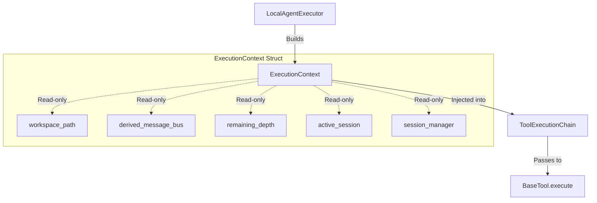

# High-Fidelity Design: Decoupled Subagent Nesting Guard, Session Isolation & Stateless Tool Pipeline

This document presents the updated detailed system design for the second stage of our Python Replica orchestration refactoring. Following decoupled, clean architecture principles, we introduce a robust **countdown-based nesting depth guard**, **stateless tool singletons**, **isolated child sub-sessions**, and **hierarchical telemetry routing**.

---

## 1. Architectural Highlights & Key Elements

To achieve perfect functional parity with the original JS CLI while providing superior runtime immutability and thread safety in Python, the design is structured around six core pillars:



### 1.1 Stateless Tool Singletons via `ExecutionContext`
In our previous implementation, tools held mutable reference state (such as `self.message_bus = message_bus` and `self.workspace_path`). This is highly susceptible to race conditions and state corruption during concurrent subagent execution.
* **The Solution**: Tools are registered as completely stateless singletons.
* **The Mechanism**: All runtime state is encapsulated in a frozen, read-only `ExecutionContext` object. This context is explicitly passed down through `execute_turn()` to the `ToolExecutionChain`, the interceptor guards, and finally to `BaseTool.execute(args, context)`.

### 1.2 Countdown-Based Nesting Depth Control
Instead of a mutable global state or thread-local storage, depth restriction is enforced via a pure, countdown-based parameter (`remaining_depth`) initialized at the bootstrapper layer and decremented at each nested subagent spawn.
* **Initialization**: The bootstrapper sets the initial `max_depth` (e.g., `1`).
* **Propagation**: The parent executor receives `remaining_depth = max_depth`.
* **Decrement**: When the `AgentTool` is invoked to delegate a sub-task, it verifies that `context.remaining_depth > 0`. If valid, it spawns the child executor with `remaining_depth = context.remaining_depth - 1`.

### 1.3 Dual-Layer Nesting Guard (Compile-Time Pruning + Fail Loudly)
To keep the execution robust, we implement a dual-layer guard:
1. **Compile-Time Omission**: If `context.remaining_depth <= 0`, the `AgentTool` is **not registered** or is **stripped from tool schemas** compiled by the `PromptStrategy`. This ensures the tool schema is never compiled into the model's system prompt context, preventing the model from calling it entirely.
2. **Runtime Execution Enforcement (Fail Loudly)**: If the model somehow invokes the `agent` tool (due to a prompt leak or pre-compiled history bias), the `AgentTool.execute` method inspects `context.remaining_depth` and immediately raises a loud `RuntimeError`, satisfying **Rule 1** of our core mandates.

### 1.4 Scoped Telemetry Routing via Hierarchical Bus
Each subagent executor derives its message bus using `parent_bus.derive(subagent_name)`. By passing this derived bus inside the `ExecutionContext`, tools simply call `context.message_bus.publish()`. Telemetry is automatically routed, scoped, and prefixed cleanly (e.g., `parent/child`) without any ad-hoc string formatting in the tools themselves.

### 1.5 JS-Compliant Parameter Mapping
In the original JS CLI, the `AgentTool` accepts either a simple raw prompt string or a dictionary. If the target subagent's schema contains exactly one property, the prompt string is mapped directly to that property; otherwise, it defaults to `{"prompt": prompt}`. This mapping logic is fully formalized inside our Pydantic validation and argument parsing boundary.

### 1.6 Child Sub-Session Isolation and Hierarchical Storage
To prevent history and listing pollution, child subagents execute within completely isolated `AgentSession` instances.
* **The `create_sub_session` Abstraction**: The `SessionManager` provides a centralized factory method `create_sub_session(parent_session_id, agent_name, query)` to construct child sessions.
* **Nested Storage Paths**: Rather than writing child sessions into the root `.replica_sessions/` directory, child sessions are written to `<storage_dir>/<parent_session_id>/<subagent_name>_<uuid_suffix>.jsonl`.
* **Clean Session Listings**: Because `list_sessions()` looks exclusively for metadata companion sidecars (`.meta.json`) in the root storage directory, child session files are physically hidden from listing commands, keeping parent listings clean while preserving files on-disk for thorough debugging.

---

## 2. Component Design & Code Structure

### 2.1 The Unified `ExecutionContext`
We define the frozen slotted container in `gemini_replica/types.py`:

```python
from typing import Any
from dataclasses import dataclass

@dataclass(slots=True, frozen=True)
class ExecutionContext:
    """
    Immutable snapshot of the active executor's runtime context.
    Safely threaded across executing tool chains and interceptor guards.
    """
    workspace_path: str
    message_bus: Any  # MessageBus
    remaining_depth: int
    session: Any      # AgentSession
    session_manager: Any  # SessionManager
```

### 2.2 Updating the Interceptor Guard Interfaces
All guards in `gemini_replica/guards.py` must receive the explicit `ExecutionContext`:

```python
from abc import ABC, abstractmethod
from typing import Dict, Any

class ToolExecutionGuard(ABC):
    @abstractmethod
    async def before_execute(self, tool_name: str, args: Dict[str, Any], context: ExecutionContext) -> bool:
        pass

    @abstractmethod
    async def after_execute(self, tool_name: str, args: Dict[str, Any], result: Any, context: ExecutionContext) -> Any:
        pass
```

### 2.3 Refactoring `BaseTool` and Subclasses
We update `BaseTool` inside `gemini_replica/tools.py` to make execution strictly parameter-driven:

```python
import os
from typing import Dict, Any, Optional
from pydantic import BaseModel, ValidationError

class BaseTool:
    def __init__(self, name: str, description: str, args_schema: Optional[type[BaseModel]] = None):
        self.name = name
        self.description = description
        self.args_schema = args_schema
        self._cached_parameters = self._compile_schema()

    def resolve_path(self, path_str: str, workspace_path: str) -> str:
        if os.path.isabs(path_str):
            resolved = os.path.abspath(path_str)
        else:
            resolved = os.path.abspath(os.path.join(workspace_path, path_str))
        return resolved

    async def execute(self, args: Dict[str, Any], context: ExecutionContext) -> Dict[str, Any]:
        """Runs the validation and business logic asynchronously."""
        import asyncio
        if self.args_schema:
            try:
                validated_args = self.args_schema(**args)
                if asyncio.iscoroutinefunction(self.run):
                    return await self.run(validated_args, context)
                return await asyncio.to_thread(self.run, validated_args, context)
            except ValidationError as e:
                return {"error": f"Schema validation failed: {e.errors()}"}
        
        if asyncio.iscoroutinefunction(self.run):
            return await self.run(args, context)
        return await asyncio.to_thread(self.run, args, context)

    def run(self, args: Any, context: ExecutionContext) -> Dict[str, Any]:
        raise NotImplementedError
```

### 2.4 Robust Sub-Session Spawning & Directory Resolution in `SessionManager`
We upgrade the session persistence layer in `gemini_replica/sessions.py` to support nested paths and clean creation of sub-sessions:

#### `AgentSession.save` Upgrades
```python
    async def save(self) -> None:
        """
        Asynchronously writes the complete session history JSON and companion metadata JSON.
        Ensures the complete directory hierarchy exists before attempting write.
        """
        # Always resolve the directory where this file will be written
        filepath = os.path.join(self.storage_dir, f"{self.session_id}{SESSION_FILE_SUFFIX}")
        meta_filepath = os.path.join(self.storage_dir, f"{self.session_id}.meta.json")
        
        # Ensure targeted storage dir and nested parent dirs exist on disk
        target_dir = os.path.dirname(filepath)
        def _ensure_dirs():
            os.makedirs(target_dir, exist_ok=True)
        await asyncio.to_thread(_ensure_dirs)

        self._metadata["last_updated"] = datetime.datetime.now().isoformat()
        if "created_at" not in self._metadata:
            self._metadata["created_at"] = self._metadata["last_updated"]
        self._metadata["turn_count"] = len(self._history)

        # Write payload files asynchronously or via thread-safe fallback...
```

#### `SessionManager.create_sub_session` Implementation
```python
    async def create_sub_session(self, parent_session_id: str, agent_name: str, query: str) -> AgentSession:
        """
        Creates a new isolated child session under the parent session's subdirectory.
        Prevents parent listing pollution while keeping sessions structurally associated.
        """
        import uuid
        child_session_id = f"{agent_name}_{uuid.uuid4().hex[:8]}"
        
        # Build nested path: storage_dir/parent_session_id
        child_storage_dir = os.path.join(self.storage_dir, parent_session_id)
        
        metadata = {
            "name": f"Subagent: {agent_name}",
            "query": query,
            "parent_session_id": parent_session_id,
            "created_at": datetime.datetime.now().isoformat(),
            "last_updated": datetime.datetime.now().isoformat(),
            "turn_count": 0
        }
        
        sub_session = AgentSession(
            session_id=child_session_id,
            storage_dir=child_storage_dir,
            chat_history=[],
            metadata=metadata,
            manager=self
        )
        await sub_session.save()
        return sub_session
```

### 2.5 The Stateless `AgentTool` with Nesting Guards
The upgraded, stateless `AgentTool` leverages the `ExecutionContext` to cleanly resolve sessions and spawn child executors:

```python
class AgentArgs(BaseModel):
    agent_name: str = Field(..., description="The name of the target subagent profile (e.g., 'coder', 'researcher').")
    prompt: str = Field(..., description="The specific, detailed task instructions for the subagent.")

class AgentTool(BaseTool):
    def __init__(self, agent_registry: AgentRegistry):
        super().__init__(
            name="agent",
            description="Delegate sub-tasks to specialized subagents. Spawns an isolated nested execution loop.",
            args_schema=AgentArgs,
        )
        self.agent_registry = agent_registry

    async def run(self, args: AgentArgs, context: ExecutionContext) -> Dict[str, Any]:
        # 1. Enforce Nesting Guard (Rule 1: Fail Loudly)
        if context.remaining_depth <= 0:
            raise RuntimeError(
                f"Nesting Depth Violation: Attempted to spawn subagent '{args.agent_name}' "
                f"but remaining depth is {context.remaining_depth}."
            )

        profile = self.agent_registry.get_profile(args.agent_name)
        if not profile:
            return {"error": f"Subagent profile '{args.agent_name}' not found."}

        # 2. Spawn isolated child session through SessionManager
        child_session = await context.session_manager.create_sub_session(
            parent_session_id=context.session.session_id,
            agent_name=args.agent_name,
            query=args.prompt
        )

        from gemini_replica.executor import LocalAgentExecutor
        
        # 3. Derive Child Message Bus (Hierarchical prefixing)
        child_bus = context.message_bus.derive(args.agent_name)
        
        # 4. Formulate subagent definition and decrement depth
        subagent_def = profile.copy()
        subagent_def["query"] = args.prompt
        
        # 5. Initialize child executor with decremented depth & isolated child session
        child_executor = LocalAgentExecutor(
            definition=subagent_def,
            workspace_path=context.workspace_path,
            client=child_session.manager if hasattr(context, "client") else None,  # Client propagated from parent
            session=child_session,
            session_manager=context.session_manager,
            remaining_depth=context.remaining_depth - 1,
            parent_bus=child_bus
        )

        # 6. Trigger execution
        sub_result = await child_executor.run(inputs={"query": args.prompt})

        return {
            "success": True,
            "agent_name": args.agent_name,
            "outcome": sub_result or "Subagent execution completed with no output."
        }
```

### 2.6 Strategy-Driven Compile-Time Tool Pruning
To ensure that the Context Strategy maintains complete control over the context, we extend `DefaultPromptInputs` to support `remaining_depth`. Inside `DefaultAgentExecutionStrategy.compile_request_context`, we compile-time prune the `"agent"` tool schema if the depth is exhausted:

```python
# In gemini_replica/context.py

@dataclass(slots=True)
class DefaultPromptInputs(BasePromptInputs):
    """Production-grade execution parameters for the default strategy."""
    platform: Optional[str] = None
    current_time: Optional[str] = None
    has_hierarchical_memory: Optional[bool] = None
    remaining_depth: int = 1  # Parameter countdown track

# Inside DefaultAgentExecutionStrategy.compile_request_context():
    async def compile_request_context(
        self,
        inputs: BasePromptInputs,
        context_repo: ContextSourceRepository,
        session: AgentSession
    ) -> ModelRequestContext:
        # ... (Assembling Prompt templates) ...
        
        # --- Tool declarations compiling ---
        tools_schemas = context_repo.tool_registry.get_function_declarations()
        
        # Strategy-driven compile-time pruning
        remaining_depth = getattr(inputs, "remaining_depth", 1)
        if remaining_depth <= 0:
            tools_schemas = [t for t in tools_schemas if t.get("name") != "agent"]

        return ModelRequestContext(
            system_instruction=final_prompt,
            tools=tools_schemas,
            contents=processed_history
        )
```

---

## 3. Verification & Safety Safeguards

### 3.1 Handled Scenarios & Edge Cases
* **Recursive Callbacks**: If an agent attempts to recursively delegate beyond the allowed threshold, the strategy completely prunes the `agent` schema from the LLM prompt. If a prompt leak occurs, the runtime `AgentTool` guard intercepts and fails loudly.
* **Isolated Disk Space**: Storing child session histories in nested subdirectories under their parent session ID avoids root listing clutter.
* **Immutable Executions**: The complete lifecycle state (MessageBuses, workspace paths, session references, and session managers) is encapsulated in the read-only, slotted `ExecutionContext` snapshot, guaranteeing perfect thread safety during concurrent or asynchronous executions.

---

> [!NOTE]
> This upgraded design maintains absolute alignment with the JS CLI, ensuring robust child session isolation and compile-time pruning under the direct steering of the `PromptStrategy`.
