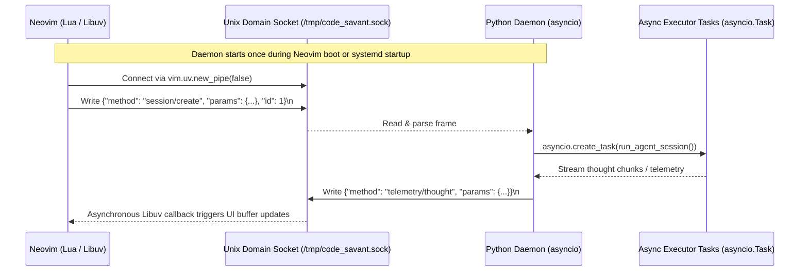

# Custom JSON-RPC over Unix Domain Sockets (UDS) Daemon Architecture

This document outlines the detailed system design for implementing a persistent, high-performance, multi-session concurrent Python daemon to interface as the backend agent harness for a Neovim UI frontend.

---

## 1. System Topology



---

## 2. Directory Structure Blueprint

```
code_savant/
├── engine/                 # Python Core Agent Orchestration Engine
│   ├── pyproject.toml      # Dependency specification (uv/pip)
│   ├── main.py             # CLI/Daemon bootstrap entrypoint
│   ├── uds_server.py       # Asynchronous Unix Domain Socket Server
│   └── ... (types, executor, bus, prompts)
│
├── nvim/                   # Neovim UI Frontend (Lua Plugin)
│   ├── lua/
│   │   └── code_savant/
│   │       ├── init.lua    # Keymaps, commands, & window/buffer layouts
│   │       └── client.lua  # Job-control communication handler (Libuv connection)
│   └── plugin/
│       └── code_savant.lua # Autocommands & entry configurations
│
├── shared/                 # Optional multi-language protocols (e.g., JSON schemas)
└── README.md
```

---

## 3. Component Specifications

### 3.1 Python Daemon: `engine/uds_server.py`
The backend daemon is built using Python's native `asyncio.start_unix_server` to establish a Unix Domain Socket (UDS) connection loop.

* **Non-Blocking Parsing:** Uses newline characters (`\n`) for stream delimiting. The incoming data-reading loop uses `asyncio.StreamReader.readline()` to parse frames with zero buffer fragmentation.
* **Concurrent Execution:** Every incoming `session/create` invocation spawns an independent, concurrent `asyncio.create_task()` running an isolated session context inside `LocalAgentExecutor`.
* **Zero Cold Starts:** Because the engine remains running in memory, it retains pre-loaded system prompt templates, tool declarations, and GenAI client configurations, enabling near-instantaneous agent response cycles.

### 3.2 Neovim UI Frontend: `nvim/lua/code_savant/client.lua`
The Neovim frontend interfaces with the active domain socket asynchronously using built-in, low-level **Libuv bindings** (`vim.uv` or `vim.loop`).

* **Asynchronous Networking:** Uses `vim.uv.new_pipe(false)` to open and maintain the socket stream completely off of the main editing thread.
* **Non-Blocking UI Updates:** Packet read callbacks (`client:read_start()`) are managed asynchronously by Libuv's event loop, preventing editor UI freezes when rendering large payloads.
* **Streaming Redraws:** Telemetry notifications such as thoughts and completions are streamed to custom side-by-side split buffers or drawn in-buffer as inline virtual text in real-time.

---

## 4. Communication Protocol Specification (JSON-RPC 2.0)

All communications are formatted as standard JSON-RPC 2.0 messages framed with a newline (`\n`) character.

### 4.1 Sample Client Request (Session Creation)
```json
{
  "jsonrpc": "2.0",
  "method": "session/create",
  "params": {
    "workspace_path": "/Users/izo/code/project",
    "query": "Fix calculation bugs in main.py",
    "agent_profile": "coder"
  },
  "id": 1
}
```

### 4.2 Sample Server Response (Success)
```json
{
  "jsonrpc": "2.0",
  "result": {
    "session_id": "coder_9a4f21bc",
    "status": "active"
  },
  "id": 1
}
```

### 4.3 Sample Server Notification (Streaming Telemetry)
```json
{
  "jsonrpc": "2.0",
  "method": "telemetry/thought",
  "params": {
    "session_id": "coder_9a4f21bc",
    "text": "Scanning calculation paths inside the target files..."
  }
}
```
